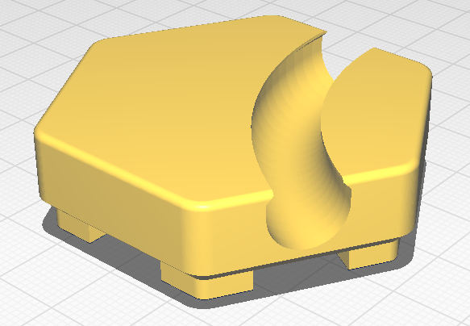

# `hextraction-cq`
## CADQuery port of Hextraction tile template

This is a CADQuery implementation of a basic template for [Hextraction](https://www.playhextraction.com/), an open-source board game by Zack Freedman.

I don't have Fusion360 but I do have a mental compulsion to do things the ~~masochistic~~parametric way, so I recreated the tile template in CADQuery. Feel free to use this as a base for your own designs! (I plan to.)

The source files include a blank tile template, as well as a cross-sectional profile for a ball channel, and an example tile with a simple channel (showing how to use `sweep()` to create a channel between two sides.)

This is released under the same license as Hextraction itself, so go nuts! If you make a cool tile using this, and you want to credit me, that'd be rad, but it's not mandatory.

TODO:
- Create Freedman-esque builtin supports
- Double check dimensions (specifically the top of the ball channel might be a little wonky)
- Add chamfer to the bottom edge of the tile
- Create a "spiky" template for triggered effects
- Create a star template for effect tiles